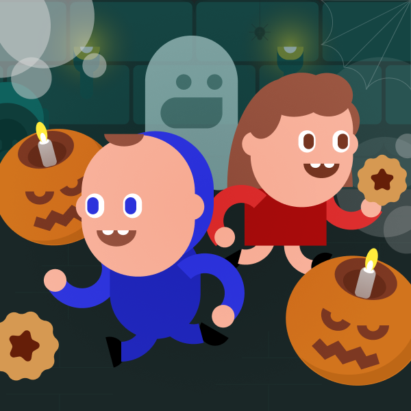

# Spooky Cookie

Welcome to Spooky Cookie, a thrilling multiplayer game inspired by such classic hits as Pac-Man and Bomberman, but with a Halloween twist! Control your character through the eerie maze, collect cookies, and compete with other players in this spooktacular adventure!

The game was created during [React Jam](https://reactjam.com/) and uses [Rune](https://www.rune.ai/) platform.

## Table of Contents

- [Gameplay](#gameplay)
- [Features](#features)
- [Installation](#installation)
- [Usage](#usage)
- [Contributing](#contributing)
- [Credits](#credits)
- [License](#license)

## Gameplay

In Spooky Cookie, your objective is to navigate the haunted maze and collect as many cookies. Compete against other players to see who can collect the most treats and emerge victorious in the challenge.

Use swipe gesture to change your character direction. Tap the screen to place an explosive pumpkin.

## Features

- Single player mode against a medium-intelligent bot
- Multiplayer gameplay for a fun and competitive experience
- Halloween-themed visuals and atmosphere
- Collectible cookies and tricky ghosts to add excitement to the game

## Installation

To get started with Spooky Cookie, follow these steps:

1. Clone the repository to your local machine using `git clone`.
2. Navigate to the project directory.
3. Install the required dependencies using `npm install` or `yarn install`.

## Usage

1. Run the game using the provided command, e.g., `npm run dev` or `yarn dev`.
2. See the console for localhost url to access the game through your web browser.

Enjoy playing Spooky Cookie with your friends and have a thrilling time in the spooky world of cookies and ghosts!

## Contributing

We welcome contributions from the open-source community. If you'd like to contribute to the project, please contact me.

## Credits

All in-game graphic content, including characters, was created by the author and is protected as their intellectual property. Sounds from [freesound.org](https://freesound.org/)

## License

This project is licensed under the Creative Commons Attribution-NonCommercial 4.0 International License. For more information, please refer to the [LICENSE](LICENSE) file.

---

Have fun playing Spooky Cookie, and may your Halloween adventure be filled with sweet treats and spooky surprises!
